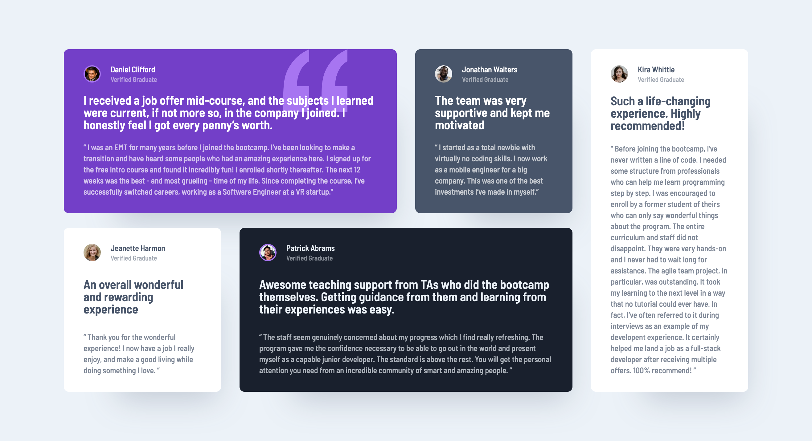

# Frontend Mentor - Testimonials grid section solution

This is a solution to the [Testimonials grid section challenge on Frontend Mentor](https://www.frontendmentor.io/challenges/testimonials-grid-section-Nnw6J7Un7). Frontend Mentor challenges help you improve your coding skills by building realistic projects.

## Table of contents

- [Overview](#overview)
  - [Screenshot](#screenshot)
  - [Links](#links)
- [My process](#my-process)
  - [Built with](#built-with)
- [Author](#author)
- [Acknowledgments](#acknowledgments)

## Overview

This project is part of the "Building Responsive Layouts" path, focusing on creating adaptable and flexible layouts. The goal of this challenge is to effectively use CSS Grid, complemented by strategic absolute positioning, to implement an icon inside the cards.

### Screenshot

### Links

- Solution URL: [Testiomnial Grid Section - GitHub Repo](https://github.com/dealencardavid/testimonials-grid-section_frontendmentor)
- Live Site URL: [Testiomnial Grid Section Page Live](https://dealencardavid.github.io/testimonials-grid-section_frontendmentor/)

## My process

### Built with

- Semantic HTML5 markup
- CSS custom properties
- Grid
- Absolute/Relative positioning
- Z-indexes

## Author

- Frontend Mentor - [@dealencardavid](https://www.frontendmentor.io/profile/dealencardavid)
- GitHub - [@dealencardavid](https://github.com/dealencardavid)

## Acknowledgments

Hats off to FrontendMentor for enabling goood resources to new frontend developers!
